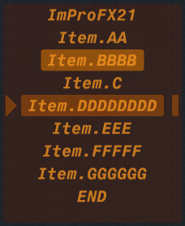
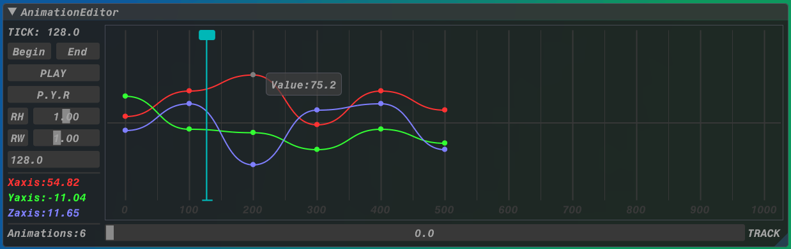
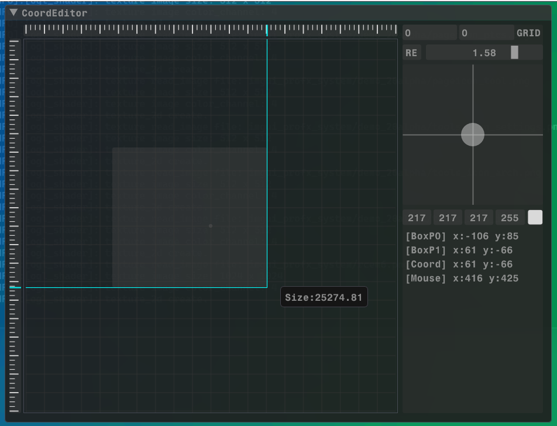

# ImProFXcontrol
> 只依赖 ImGui核心 与 标准库 的ImGui自制控件.

- __新增:__ 组合快捷键编辑器.
- __公告:__ 当前项目状态 __维护暂停__ ... 如果有新增控件[BiliBili](https://space.bilibili.com/475659860)会同步发视频.
- __更新:__ ---
  
> Code: 2024.05.30 Docs: 2024.05.30 RCSZ

__文档:__ [里边请~](https://github.com/rcszc/ImProFXcontrol/blob/main/im_docs/IMPROFX_DOC.md)

  
  

  
  

---
